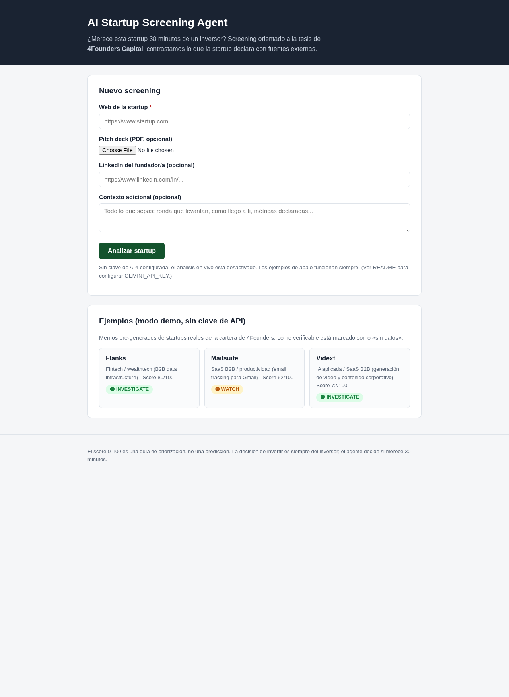
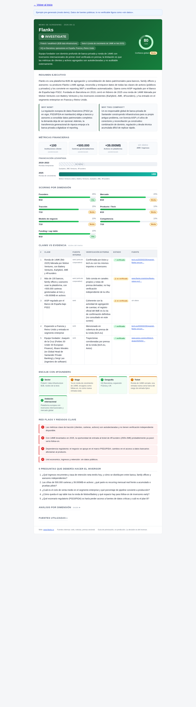

# Startup Scouting

Agente de screening de startups orientado a la tesis de un fondo VC early-stage. Recibe la web de una startup (más pitch deck y contexto opcionales), contrasta lo que la startup declara con fuentes externas mediante búsqueda web, y genera un **investment memo de 1 página** con recomendación 🟢 INVESTIGATE / 🟡 WATCH / 🔴 PASS, scoring ponderado por dimensión, tabla de claims vs evidencia, red flags y 5 preguntas para el inversor.

La pregunta que responde no es "¿invertimos?" sino: **¿merece esta startup 30 minutos de un inversor?**


## Capturas

| Landing | Memo (ejemplo: Flanks) |
|---|---|
|  |  |

## Requisitos

- **Node.js 18 o superior** (recomendado 20+). Compruébalo con `node --version`.
- Una **clave de API de Google Gemini** (gratis en [Google AI Studio](https://aistudio.google.com/apikey)). Solo es necesaria para el análisis en vivo: los ejemplos precargados funcionan sin clave.

## Instalación (una sola vez)

```bash
cd screening-agent
npm install
```

## Configurar la clave de Gemini

La clave se lee de la variable de entorno `GEMINI_API_KEY`. **Nunca la escribas en el código ni la subas a ningún repositorio.**

**Mac / Linux:**

```bash
export GEMINI_API_KEY="tu-clave-aqui"
```

**Windows (PowerShell):**

```powershell
$env:GEMINI_API_KEY="tu-clave-aqui"
```

Para no tener que repetirlo en cada terminal, copia `.env.example` a `.env`, pon ahí tu clave y arranca con:

```bash
export $(grep -v '^#' .env | xargs)   # Mac/Linux
```

## Ejecutar

```bash
npm start
```

Abre el navegador en **http://localhost:3000**

- **Con clave**: rellena el formulario (web obligatoria; deck PDF, LinkedIn y contexto opcionales) y pulsa *Analizar startup*. Tarda 1-2 minutos: extrae la web, busca verificación externa y genera el memo.
- **Sin clave**: el formulario avisa de que falta `GEMINI_API_KEY`, pero los **5 ejemplos pre-generados** (startups reales) se pueden ver igualmente.

## Cómo funciona

1. **Extracción**: el servidor descarga la web de la startup (página principal + subpáginas tipo about/pricing/producto) y el texto del deck PDF si lo hay.
2. **Verificación externa**: se llama a la API de Gemini con la herramienta de búsqueda de Google activada, de modo que el modelo busca en la web señales independientes (mercado, competidores, funding, equipo, contratación, reseñas).
3. **Memo estructurado**: el modelo rellena un esquema JSON fijo que implementa el template (Parte A) y la rúbrica (Parte B) del documento de especificación, y la web lo renderiza como memo de 1 página.
4. **Ejemplos precargados**: la carpeta `memos/` contiene memos generados en el mismo formato JSON; se sirven sin llamar a ninguna API.

Reglas del agente (heredadas de la especificación): si un dato no se puede obtener, el memo dice "sin datos" en vez de inventarlo; todo claim relevante pasa por la tabla de contraste; un claim contradicho en tracción, funding o founders fuerza PASS.

## Despliegue en Vercel (opcional)

El proyecto ya incluye `vercel.json`:

```bash
npm i -g vercel
vercel
```

Después, en el panel de Vercel: *Settings → Environment Variables* → añade `GEMINI_API_KEY` con tu clave. La subcarpeta `memos/` se despliega con la app, así que los ejemplos siguen funcionando.

## Estructura

```
screening-agent/
├── server.js          # Servidor Express (API + estáticos)
├── lib/
│   ├── extract.js     # Extracción de la web de la startup
│   ├── gemini.js      # Llamada a Gemini (búsqueda + salida estructurada)
│   └── prompt.js      # Prompt del sistema: template + rúbrica de scoring
├── public/            # Interfaz web (index.html, styles.css, app.js)
├── memos/             # Ejemplos precargados
├── vercel.json        # Config de despliegue
└── .env.example       # Plantilla para la clave (no subir el .env real)
```

## Limitaciones conocidas

- LinkedIn no se puede leer directamente (bloquea el scraping); el agente busca información pública sobre la persona a cambio.
- Las cifras que solo constan en canales de la propia startup quedan marcadas como "no verificadas" — es deliberado: el contraste es el producto.
- La calidad de la verificación depende de lo que la búsqueda web encuentre; startups muy tempranas tendrán muchos "sin datos".
